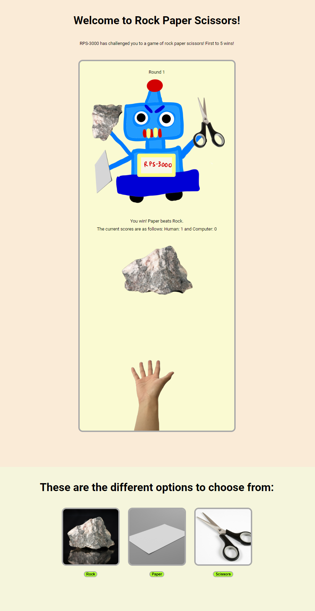

# odin-rock-paper-scissors
This project is part of the foundations course of The Odin Project.

During this project I applied my newly learned JS knowledge of DOM manipulation.

I was success in creating an interactive webpage to play the critically acclaimed game of Rock Paper Scissors.

Click [here](https://pakmangames.github.io/odin-rock-paper-scissors/) to play for yourself. (Works best on a vertical monitor lol)

Here is a preview of what the page looks like:

References for images that weren't mine:
[Rock](https://unsplash.com/photos/brown-and-gray-stone-fragment-9kRjMMLSPqw)
[Paper](https://unsplash.com/photos/a-white-sheet-of-paper-on-a-gray-background-5fK6JbmbBSY)
[Scissors](https://unsplash.com/photos/a-pair-of-scissors-sitting-on-top-of-a-white-table-5KJzOlsDvVw)